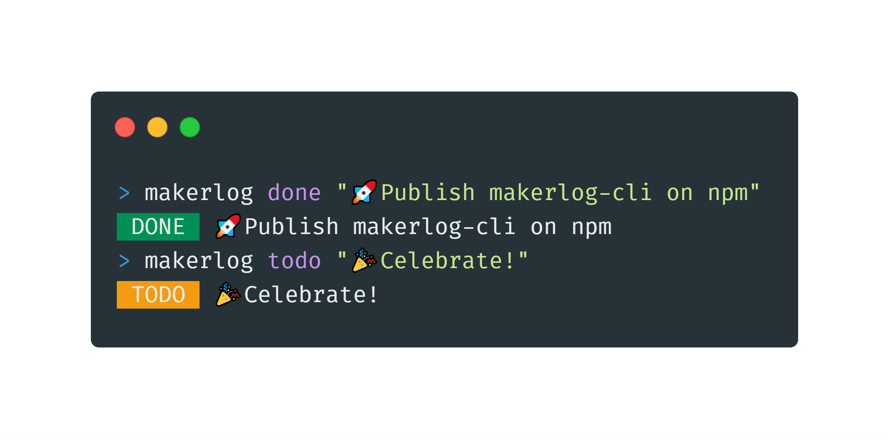

<h1 align="center">
	<br>
	<br>
	
	<br>
	<br>
	<br>
</h1>
# Makerlog CLI

An unoffical command line tool for [Makerlog](https://getmakerlog.com).

## Install

To install the latest version of Makerlog CLI run this command:

```
$ npm install -g makerlog-cli
```

## Usage

Authenticate with your Makerlog account:

```
$ makerlog login --username "your_username" --password "your_password
```

The tool does not store your username or password, it only uses them to get a token from Makerlog.

After you're logged in you can log new tasks:
```
$ makerlog done "I installed makerlog-cli github.com/MihaiVoinea/makerlog-cli"	# Add a new 'done' task
$ makerlog todo "Start using makerlog-cli github.com/MihaiVoinea/makerlog-cli"	# Add a new 'todo' task
```

## Planned features:

- Add multiple tasks at once
- See your remaining tasks
- Mark a task as doing/done
- Build a CLI user interface
- Get notifications
